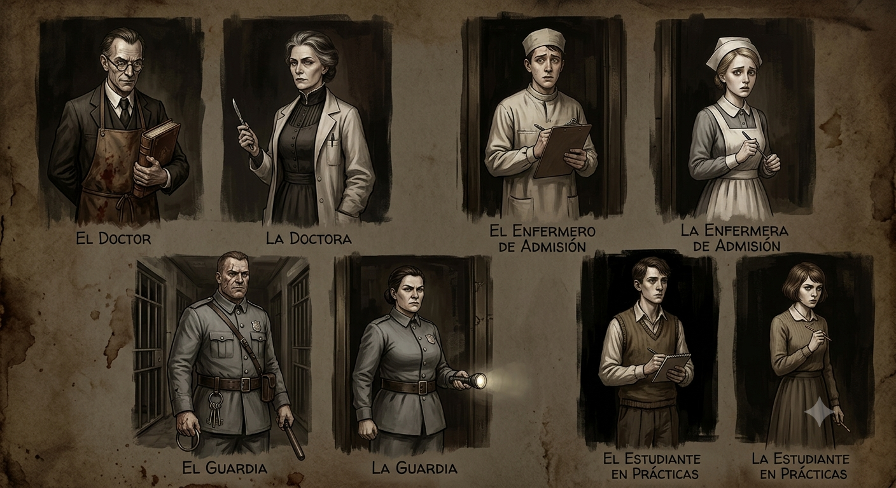

<p align="center">
  
</p>

<h1 align="center">Eldritch Sanatorium</h1>
<p align="center">
  <em>Archivos Clínicos del Horror Cósmico</em>
</p>

<p align="center">
  
  
  
  
  
</p>

<p align="center">
  <a href="#sinopsis">Sinopsis</a> •
  <a href="#características">Características</a> •
  <a href="#roles">Roles</a> •
  <a href="#instalación">Instalación</a> •
  <a href="#estructura">Estructura</a> •
  <a href="#desarrollo">Desarrollo</a>
</p>

---

## Sinopsis

**Arkham, Massachusetts — 1928.**

El Sanatorio Psiquiátrico de Miskatonic alberga pacientes que han visto más allá del velo de la realidad. Sus delirios no son fantasías: son profecías. Sus crisis, ecos de entidades que moran en los ángulos muertos del espacio.

Como miembro del personal clínico, deberás enfrentar la locura que corroe las mentes de los internos. Elige tu rol. Entra en el pabellón. Y recuerda: no todo lo que habita en estas paredes es humano.

_Eldritch Sanatorium_ es un videojuego web de estrategia y combate de cartas por turnos (_single player_) ambientado en el universo de horror cósmico de H. P. Lovecraft. Cada partida se compone de una ronda de **5 pacientes**. El jugador selecciona uno de los **4 roles disponibles**, cada uno con condiciones de victoria, mecánicas y cartas propias. Las acciones de los roles previos afectan a los siguientes mediante un sistema de **dossier persistente**.

---

## Características

### Gameplay

- **4 roles jugables** con mecánicas, mazos (14 cartas cada uno) y condiciones de victoria únicas
- **5 patologías enemigas** con comportamientos, estadísticas y mazos propios
- **56 cartas** distribuidas en 4 mazos, con **16 tipos de efectos** distintos
- **Sistema de dossier**: las acciones de Guardia y Enfermero reducen las estadísticas de los pacientes del Doctor
- **40 nodos narrativos** con preguntas lovecraftianas, exclusivos para el rol de Alumno
- **Sistema de eventos aleatorios** del personal del sanatorio entre turnos
- **Medidor personal** que varía por rol y persiste entre pacientes, acumulando fatiga estratégica
- **5 pacientes por partida** con duración ajustada para sesiones ágiles

### Técnicas

- **Sin dependencias externas**: JavaScript (ES6+ modules), HTML5, CSS3 puro
- **Persistencia en localStorage** para el sistema de dossier entre roles
- **Diseño responsive** completo: ultra-wide, desktop, tablet (landscape y portrait), smartphone
- **Adaptación a pantallas de altura reducida** para dispositivos en landscape
- **Arquitectura modular** MVC-like con separación clara de responsabilidades

---

## Roles

### 🛡️ Guardia de Seguridad

| | |
|---|---|
| **Avatar** | Edgar Vance / Rebecca Cole |
| **Escenario** | Pasillo de Celdas |
| **Medidor** | Aguante Físico (máx. 50, decrece) |
| **Victoria** | Reducir ATK enemigo a 0 |
| **Rol** | Primera línea. Prepara al paciente reduciendo su capacidad ofensiva. |

Estrategia: Usar debuffs, escudos y daño controlado. Tanque del equipo.

### 💉 Enfermero/a

| | |
|---|---|
| **Avatar** | Walter Bishop / Miriam Crowe |
| **Escenario** | Sala de Triaje |
| **Medidor** | Estrés Clínico (máx. 35, crece desde 0) |
| **Victoria** | Reducir HP del paciente al 50% |
| **Rol** | Mitigador. Deja al paciente sedado para el Doctor. |

Estrategia: Gestionar el estrés mientras seda al paciente. Medidor inverso: si llega al máximo, colapsa.

### 🔬 Doctor/a

| | |
|---|---|
| **Avatar** | Alistair Blackwood / Priscilla Dunwich |
| **Escenario** | La Consulta |
| **Medidor** | Resistencia del Doctor (máx. 40, decrece) |
| **Victoria** | Reducir HP del paciente a 0 |
| **Rol** | Closer. Se beneficia del trabajo de los roles previos. |

Estrategia: Curar su propio medidor mientras inflige daño. Recibe pacientes con estadísticas reducidas si Guardia y Enfermero hicieron bien su trabajo.

### 📚 Alumno/a en Prácticas

| | |
|---|---|
| **Avatar** | Cedric Holloway / Dorothea Harrow |
| **Escenario** | Galería de Observación |
| **Medidor** | Cordura Propia (máx. 30, decrece) |
| **Victoria** | Reducir HP del paciente a 0 |
| **Rol** | Apoyo con sistema narrativo interactivo. |

Estrategia: Responder preguntas lovecraftianas mientras combate. Respuestas correctas restauran cordura y energía.

---

## Instalación

### Requisitos

- Navegador web moderno con soporte para módulos ES6 (Chrome, Firefox, Edge, Safari)
- Servidor HTTP local (necesario para evitar bloqueos CORS con `type="module"`)

### Inicio rápido

```bash
# Clonar el repositorio
git clone https://github.com/tu-usuario/eldritch-sanatorium.git
cd eldritch-sanatorium

# Iniciar servidor de desarrollo
npx live-server .
```

Alternativas al servidor:

```bash
# Python 3
python -m http.server 8000

# Node.js (http-server)
npx http-server .
```

Abrir `http://localhost:8000` (o el puerto que corresponda) en el navegador.

> **Nota**: El proyecto no requiere instalación de dependencias ni proceso de build. Es JavaScript nativo sin frameworks.

---

## Estructura

```
elden/
├── index.html                           # Punto de entrada único (SPA)
│
├── assets/
│   ├── css/
│   │   └── styles.css                   # Diseño responsive completo
│   │
│   ├── js/
│   │   ├── main.js                      # Orquestador SPA, transiciones, callbacks
│   │   ├── engine.js                    # Motor de combate, lógica de juego, utilidades
│   │   ├── ui.js                        # Renderizado dinámico de interfaz
│   │   ├── carts.json                   # 56 cartas distribuidas en 4 mazos
│   │   ├── personajes.json              # 4 personajes con variantes de género
│   │   ├── enemigos.json                # Banco de pacientes y 5 patologías
│   │   └── preguntas_alumno.json        # 40 nodos narrativos lovecraftianos
│   │
│   └── img/
│       ├── backgrounds/                 # Fondos de los tableros por rol
│       ├── cards/                       # Arte de las cartas
│       └── characters/                  # Retratos de personajes y pacientes
│
└── prompts/
    └── memoria/README.md                # Memoria técnica del proyecto
```

### Arquitectura

```
index.html → main.js (orquestador)
                  ├── fetch → carts.json, personajes.json, enemigos.json, preguntas_alumno.json
                  ├── MenuUI.dibujarMenuSeleccion()
                  └── ejecutarTransicionATablero()
                        └── PacienteFactory → genera paciente aleatorio
                        └── CombatManager → motor de combate
                              ├── jugarCarta()
                              ├── procesarTurnoEnemigo()
                              ├── verificarCondicionesFin()
                              └── generarDossier() → localStorage
```

---

## Desarrollo

### Sistema de combate

El ciclo de turno sigue esta secuencia:

1. **Turno del jugador**: juega cartas de su mano consumiendo energía
2. **Fin de turno**: el jugador pulsa "Terminar Turno"
3. **Turno enemigo**: se calcula y aplica el daño (físico + inevitable), se registra en la bitácora
4. **Reposición**: el jugador recupera energía, se reinicia el escudo, se roba 1 carta
5. **Evento aleatorio** (30% de probabilidad): un PNJ del sanatorio interviene
6. **[Alumno]**: se activa el nodo narrativo correspondiente

### Sistema de efectos de cartas

El motor procesa 16 tipos de efectos mediante un procesador universal:

- `bloqueo`, `daño_crisis`, `reducir_medidor`, `sanar_medidor`
- `reducir_ataque`, `robar_cartas`
- Efectos combinados: `daño_y_debuff`, `daño_y_cura`, `daño_y_block`, `daño_y_robo`
- `robo_y_block`, `debuff_y_block`, `cura_y_robo`, `cura_y_block`
- Especiales: `robo_con_daño`, `sanar_medidor_con_contraefecto`

### Sistema de medidor

Cada personaje tiene un medidor personal que representa su recurso crítico:

| Rol | Medidor | Máx. | Inicio | Tipo |
|---|---|---|---|---|
| Guardia | Aguante Físico | 50 | 50 | Decrece (vida) |
| Doctor | Resistencia del Doctor | 40 | 40 | Decrece (vida) |
| Alumno | Cordura Propia | 30 | 30 | Decrece (vida) |
| Enfermero | Estrés Clínico | 35 | 0 | Crece (estrés) |

El medidor **persiste entre pacientes**, añadiendo presión estratégica a medida que avanza la partida.

---

## Siguientes Actualizaciones:

- Mejorar y dejar listo el responsive para todos los dispositivos posibles
- Usar imágenes de fondo y de cartas sin IA. Hablaremos con diseñadores
- Funcionalidad de registro y historial de partidas

---

<p align="center">
  <sub>Construido con JavaScript, HTML y CSS — sin frameworks, sin excusas.</sub>
  <br>
  <sub>Sumérgete en la locura. El sanatorio te espera.</sub>
</p>
